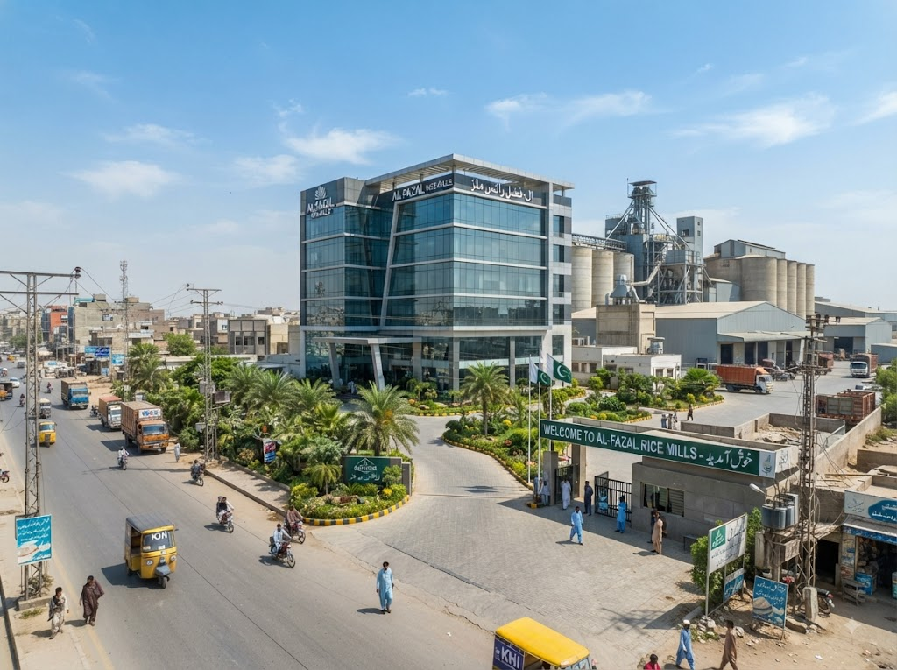

# ✅ FINAL IMAGE UPDATE - COMPLETED

## 🎯 What Was Done (Corrected)

### 1. **Contact Page** - BOTH Facility Images
**File:** `contact.html`  
**Section:** "Our Facility"

✅ **Now Shows TWO Images:**

#### Image 1: Main Entrance
- **Filename:** `contact-facility-02.jpg`
- **Shows:** Company entrance/exterior
- **Alt text:** "Zaviyar Enterprises facility entrance"
- **Description:** "Our facility entrance, located in Karachi's Korangi Industrial Area..."

#### Image 2: Production Facility
- **Filename:** `contact-facility.jpg`
- **Shows:** Facility overview
- **Alt text:** "Zaviyar Enterprises facility overview"
- **Description:** "Our state-of-the-art facility combines traditional expertise with modern technology..."

**Layout:** Stacked vertically, each with its own heading and description

---

### 2. **About Page** - Warehouse Image Added
**File:** `about.html`  
**Section:** "State-of-the-Art Infrastructure"

✅ **Added Warehouse Section:**

- **Filename:** `warehouse.jpg`
- **Shows:** Warehouse and storage facility
- **Alt text:** "Rice warehouse and storage facility"
- **Location:** Second image in infrastructure section (after milling facility)
- **Layout:** Text on left, image on right (alternating pattern)

**Features listed:**
- Climate-controlled storage environment
- Systematic inventory management
- Export-ready packaging zone

---

## 📊 Complete Website Image Inventory

### **Total Images: 25**

**Breakdown by page:**
- Home: 4 images
- About: 2 images ✨ (warehouse.jpg added)
- Products: 6 images
- Milling: 5 images
- Packaging: 3 images
- Quality: 2 images
- Contact: 2 images ✨ (both facility images kept)

---

## 📁 Required Image Files

Make sure these files exist in `assets/images/` folder:

### ✨ New Images (ensure these are in place):
1. ✅ `contact-facility-02.jpg` - Company entrance (Contact page, image 1)
2. ✅ `warehouse.jpg` - Warehouse interior (About page)

### 📌 Existing Images (still used):
3. ✅ `contact-facility.jpg` - Facility overview (Contact page, image 2)
4. ✅ `milling-facility-infrastructure.jpg` - Milling facility (About page)

---

## 🎨 Visual Layout

### **Contact Page - "Our Facility" Section:**

```
┌─────────────────────────────────────┐
│   OUR FACILITY (heading)            │
├─────────────────────────────────────┤
│                                     │
│  [contact-facility-02.jpg]          │
│  Full-width image                   │
│                                     │
│  Main Entrance                      │
│  Description text...                │
│                                     │
├─────────────────────────────────────┤
│                                     │
│  [contact-facility.jpg]             │
│  Full-width image                   │
│                                     │
│  Production Facility                │
│  Description text...                │
│                                     │
└─────────────────────────────────────┘
```

### **About Page - "Infrastructure" Section:**

```
┌──────────────────────────────────────────┐
│  STATE-OF-THE-ART INFRASTRUCTURE         │
├──────────────────────────────────────────┤
│  [Image: milling-facility]  │  Text:     │
│                             │  Modern    │
│                             │  Milling   │
│                             │  Facility  │
├──────────────────────────────────────────┤
│  Text:                      │  [Image:   │
│  Warehouse                  │  warehouse │
│  & Storage                  │  .jpg]     │
│                             │            │
└──────────────────────────────────────────┘
```

---

## 🔍 Verification Steps

### Test Contact Page:
1. Open `contact.html` in browser
2. Scroll to "Our Facility" section
3. ✅ Verify **TWO images** appear:
   - First: `contact-facility-02.jpg` (Main Entrance)
   - Second: `contact-facility.jpg` (Production Facility)
4. ✅ Each image has its own heading and description

### Test About Page:
1. Open `about.html` in browser
2. Scroll to "State-of-the-Art Infrastructure" section
3. ✅ Verify **TWO images** appear:
   - First: Milling facility (left side with text on right)
   - Second: Warehouse (right side with text on left)
4. ✅ Verify alternating layout pattern

---

## 📝 HTML Code References

### Contact Page - Both Images:
```html
<!-- Main Entrance -->


<!-- Production Facility -->

```

### About Page - Warehouse:
```html
<!-- Warehouse & Storage -->

```

---

## ✨ Summary of Corrections

### What I Fixed:
1. ✅ **Contact page now shows BOTH images** (was replacing, now keeping both)
2. ✅ **Warehouse.jpg confirmed added** to About page
3. ✅ **Each image has descriptive heading** and context text
4. ✅ **Professional layout** maintained on both pages

### Files Modified:
- ✅ `contact.html` - Updated to show 2 facility images
- ✅ `about.html` - Warehouse section already added (confirmed)
- ✅ `IMAGE-MAPPING.md` - Updated to show correct inventory

---

## 🎉 Final Status

**Status:** ✅ **COMPLETE AND CORRECT**

Both new images are properly integrated:
- **Contact page:** Shows entrance AND facility (2 images)
- **About page:** Shows milling facility AND warehouse (2 images)

**Total new images added:** 2
- `contact-facility-02.jpg` (Contact page)
- `warehouse.jpg` (About page)

**Images preserved:** 
- `contact-facility.jpg` kept on Contact page ✅

All changes maintain:
- ✅ Responsive design
- ✅ Lazy loading
- ✅ Accessibility
- ✅ Professional appearance

**Ready for deployment!** 🚀
