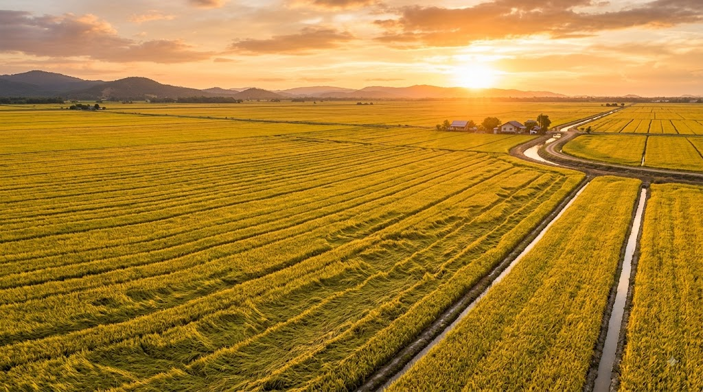

# 🎨 IMAGE GENERATION GUIDE - ZAVIYAR ENTERPRISES WEBSITE

## 📊 TOTAL IMAGES NEEDED: **15-20 Images**

All images should be **1920x1080px** for hero images and **800x600px** for product/content images.

---

## 🏠 **HOME PAGE (index.html)** - 4 Images

### IMAGE 1: Hero Background
**File Name:** `hero-rice-field.jpg`  
**Location:** Hero section background  
**Size:** 1920x1080px

**Generation Prompt:**
```
Ultra-wide aerial photograph of a vast golden rice paddy field at sunset, mature rice stalks swaying gently, warm golden hour lighting, professional agricultural photography, cinematic composition, shallow depth of field, vibrant emerald green and golden yellow tones, pristine cultivation rows visible, peaceful rural landscape, high resolution, photorealistic, 8K quality
```

### IMAGE 2: Super Kernel Basmati Rice
**File Name:** `super-kernel-basmati.jpg`  
**Location:** Home page featured product card 1  
**Size:** 800x600px

**Generation Prompt:**
```
Close-up macro photography of premium Super Kernel Basmati rice grains, long slender grains (8mm+), pearly white color, pristine quality, arranged artistically on white ceramic surface, soft studio lighting, shallow depth of field, ultra-sharp detail showing grain texture, clean professional food photography, high resolution
```

### IMAGE 3: 1121 Sella Basmati Rice
**File Name:** `1121-sella-basmati.jpg`  
**Location:** Home page featured product card 2  
**Size:** 800x600px

**Generation Prompt:**
```
Professional food photography of golden parboiled 1121 Sella Basmati rice, warm amber-golden colored grains, extra-long grain variety, arranged in elegant pile on white background, soft studio lighting highlighting the golden hue, sharp focus, ultra-high detail, premium quality visible, food photography style
```

### IMAGE 4: IRRI-6 Non-Basmati Rice
**File Name:** `irri-6-rice.jpg`  
**Location:** Home page featured product card 3  
**Size:** 800x600px

**Generation Prompt:**
```
High-quality photograph of white IRRI-6 non-basmati rice grains, medium grain length (6mm), uniform white color, scattered naturally on clean white surface, professional food photography, bright even lighting, crisp detail, commercial quality photography, 4K resolution
```

---

## 📖 **ABOUT US PAGE (about.html)** - 1 Image

### IMAGE 5: Modern Milling Facility
**File Name:** `milling-facility-infrastructure.jpg`  
**Location:** Infrastructure section  
**Size:** 800x600px

**Generation Prompt:**
```
Modern industrial rice milling facility interior, state-of-the-art stainless steel machinery, large-scale rice processing equipment, color sorting machines, conveyor belts, clean hygienic environment, bright industrial lighting, professional architectural photography, wide-angle shot showing scale, high-tech agricultural processing plant, pristine condition, 4K quality
```

---

## 🌾 **PRODUCTS PAGE (products.html)** - 6 Images

### IMAGE 6: Super Kernel Basmati (Products Page)
**File Name:** `product-super-kernel.jpg`  
**Size:** 800x600px

**Generation Prompt:**
```
Premium Super Kernel Basmati rice in elegant wooden bowl, ultra-long grains (8.3mm), pearly white translucent grains, artistic food styling, rustic wooden table background, natural daylight, shallow depth of field, professional food photography, magazine quality, high resolution
```

### IMAGE 7: 1121 Steam Basmati
**File Name:** `product-1121-steam.jpg`  
**Size:** 800x600px

**Generation Prompt:**
```
Freshly steamed 1121 Basmati rice, fluffy texture visible, steam rising, extra-long grain variety, white pristine grains, served in modern white ceramic bowl, professional food photography, clean background, soft natural lighting, appetizing presentation, commercial photography quality
```

### IMAGE 8: 1121 Sella Basmati (Products Page)
**File Name:** `product-1121-sella.jpg`  
**Size:** 800x600px

**Generation Prompt:**
```
Golden 1121 Sella parboiled Basmati rice in traditional burlap sack, warm golden-amber colored grains spilling out, rustic agricultural setting, natural lighting, professional product photography, rich golden tones, premium quality visible, textured background, high detail
```

### IMAGE 9: IRRI-6 (Products Page)
**File Name:** `product-irri-6.jpg`  
**Size:** 800x600px

**Generation Prompt:**
```
IRRI-6 non-basmati rice grains in modern glass container, medium grain length, uniform white color, clean commercial presentation, bright studio lighting, minimalist white background, professional product photography, crisp sharp focus, high resolution
```

### IMAGE 10: C9 Rice
**File Name:** `product-c9-rice.jpg`  
**Size:** 800x600px

**Generation Prompt:**
```
C9 rice variety in traditional clay pot, medium-grain white rice, authentic presentation, natural wood surface, warm lighting, cultural food photography style, rustic elegant composition, professional quality, appetizing appearance, 4K detail
```

### IMAGE 11: Broken Rice
**File Name:** `product-broken-rice.jpg`  
**Size:** 800x600px

**Generation Prompt:**
```
Broken rice grains in industrial setting, bulk commodity presentation, clean white broken rice pieces, commercial storage bag visible, industrial agricultural photography, bright even lighting, professional product shot, suitable for B2B marketing
```

---

## 🏭 **MILLING & PROCESSING PAGE (milling.html)** - 5 Images

### IMAGE 12: Cleaning Process
**File Name:** `process-cleaning.jpg`  
**Size:** 800x600px

**Generation Prompt:**
```
Rice cleaning and sorting machinery in action, raw paddy being cleaned, industrial screeners removing impurities, modern agricultural equipment, stainless steel machinery, bright factory lighting, industrial process photography, clean professional environment, technical documentation style
```

### IMAGE 13: De-husking Process
**File Name:** `process-dehusking.jpg`  
**Size:** 800x600px

**Generation Prompt:**
```
Rice de-husking machine operation, mechanical husking process visible, brown rice emerging from equipment, industrial rice processing, close-up of machinery, professional industrial photography, technical precision, clean modern facility
```

### IMAGE 14: Polishing Process
**File Name:** `process-polishing.jpg`  
**Size:** 800x600px

**Generation Prompt:**
```
Rice polishing equipment, white polished rice grains flowing through polishing machine, modern industrial rice polisher, gleaming white rice output, bright factory environment, professional process photography, state-of-the-art technology visible
```

### IMAGE 15: Color Sorting Process
**File Name:** `process-color-sorting.jpg`  
**Size:** 800x600px

**Generation Prompt:**
```
Advanced optical rice color sorting machine in operation, high-tech sensors and cameras visible, rice grains being sorted, LED lighting, modern technology, precision agricultural equipment, futuristic industrial setting, professional technical photography
```

### IMAGE 16: Packaging Process
**File Name:** `process-packaging.jpg`  
**Size:** 800x600px

**Generation Prompt:**
```
Automated rice packaging line, bags being filled and sealed, industrial packaging machinery, clean hygienic packaging area, modern food processing facility, efficient production line, professional industrial photography, organized systematic operation
```

---

## 📦 **PACKAGING & EXPORT PAGE (packaging.html)** - 4 Images

### IMAGE 17: PP Bags Packaging
**File Name:** `packaging-pp-bags.jpg`  
**Size:** 800x600px

**Generation Prompt:**
```
Stack of white polypropylene (PP) rice bags, 25kg and 50kg sizes, professional commercial packaging, clean warehouse setting, organized storage, industrial product photography, crisp branding space visible, export-ready packaging, professional quality
```

### IMAGE 18: Jute Bags Packaging
**File Name:** `packaging-jute-bags.jpg`  
**Size:** 800x600px

**Generation Prompt:**
```
Natural jute burlap bags filled with rice, eco-friendly sustainable packaging, rustic texture, premium organic presentation, natural lighting, environmental conscious packaging, traditional meets modern, professional product photography
```

### IMAGE 19: Container Loading
**File Name:** `export-container-loading.jpg`  
**Size:** 800x600px

**Generation Prompt:**
```
Shipping container being loaded with rice cargo, forklift moving pallets, international export operation, port or warehouse setting, professional logistics photography, organized efficient loading process, commercial shipping scene, blue shipping container
```

### IMAGE 20: Global Export
**File Name:** `export-global-shipping.jpg`  
**Size:** 800x600px

**Generation Prompt:**
```
Cargo ship at port loaded with containers, international shipping concept, sunset or golden hour lighting, maritime logistics, professional commercial photography, global trade visualization, wide cinematic shot, professional quality
```

---

## 🔬 **QUALITY ASSURANCE PAGE (quality.html)** - 2 Images

### IMAGE 21: Quality Lab Testing
**File Name:** `quality-lab-testing.jpg`  
**Size:** 800x600px

**Generation Prompt:**
```
Modern food safety laboratory, scientist in white lab coat examining rice samples, microscopes and testing equipment visible, clean sterile environment, professional laboratory photography, quality control testing in progress, high-tech analytical instruments, bright clinical lighting
```

### IMAGE 22: Certification & Standards
**File Name:** `quality-certifications.jpg`  
**Size:** 800x600px

**Generation Prompt:**
```
Professional quality control inspection, rice samples in petri dishes and testing trays, grading process, quality assurance documentation, HACCP and ISO certification visible in background, professional industrial photography, attention to detail, clinical precision
```

---

## 📞 **CONTACT PAGE (contact.html)** - 1 Image (Optional)

### IMAGE 23: Office or Facility Exterior (Optional)
**File Name:** `contact-facility.jpg`  
**Size:** 800x600px

**Generation Prompt:**
```
Modern rice milling facility exterior, professional corporate building, clean architectural photography, business headquarters, blue sky background, landscaped entrance, professional commercial real estate photography style, welcoming corporate appearance
```

---

## 📝 **IMPLEMENTATION INSTRUCTIONS**

### Step 1: Generate Images
Use the prompts above with AI image generators like:
- **Midjourney**: Best quality, most realistic
- **DALL-E 3**: Good for food photography
- **Stable Diffusion**: Free alternative
- **Leonardo.AI**: Good for commercial use

### Step 2: Save Images
Save generated images in: `assets/images/`

Use these exact filenames:
```
assets/images/hero-rice-field.jpg
assets/images/super-kernel-basmati.jpg
assets/images/1121-sella-basmati.jpg
assets/images/irri-6-rice.jpg
assets/images/milling-facility-infrastructure.jpg
assets/images/product-super-kernel.jpg
assets/images/product-1121-steam.jpg
assets/images/product-1121-sella.jpg
assets/images/product-irri-6.jpg
assets/images/product-c9-rice.jpg
assets/images/product-broken-rice.jpg
assets/images/process-cleaning.jpg
assets/images/process-dehusking.jpg
assets/images/process-polishing.jpg
assets/images/process-color-sorting.jpg
assets/images/process-packaging.jpg
assets/images/packaging-pp-bags.jpg
assets/images/packaging-jute-bags.jpg
assets/images/export-container-loading.jpg
assets/images/export-global-shipping.jpg
assets/images/quality-lab-testing.jpg
assets/images/quality-certifications.jpg
assets/images/contact-facility.jpg
```

### Step 3: Replace Unsplash URLs
In each HTML file, replace the Unsplash URLs with local image paths:

**BEFORE:**
```html

```

**AFTER:**
```html

```

---

## 🎯 **QUICK REFERENCE**

| Page | Images Needed | Priority |
|------|--------------|----------|
| Home | 4 images | HIGH ⭐⭐⭐ |
| About | 1 image | HIGH ⭐⭐⭐ |
| Products | 6 images | HIGH ⭐⭐⭐ |
| Milling | 5 images | MEDIUM ⭐⭐ |
| Packaging | 4 images | MEDIUM ⭐⭐ |
| Quality | 2 images | LOW ⭐ |
| Contact | 1 image | LOW ⭐ |

**TOTAL: 23 images**

---

## 💡 **PRO TIPS**

1. **Consistency**: Use same style/tone for all images
2. **Quality**: Minimum 800x600px, prefer 1920x1080px for flexibility
3. **Format**: Use JPG for photos (better compression)
4. **Optimization**: Compress images to <200KB each using TinyPNG
5. **Alt Text**: Already provided in HTML files
6. **Testing**: Test lazy loading after adding images

---

**Need help?** All image references are already set up in the HTML files. Just generate, save, and replace URLs!
