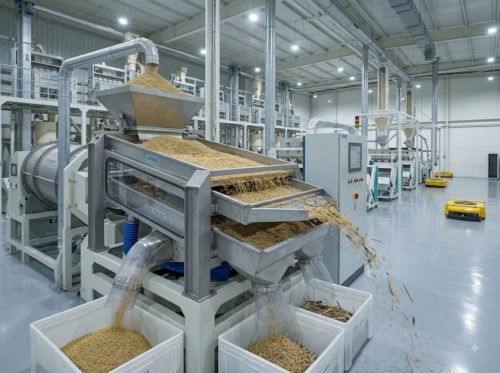

# 🎨 REALISTIC IMAGE GENERATION GUIDE - ZAVIYAR ENTERPRISES

## 🏢 COMPANY IDENTITY & LOCATION

**Company Name:** Zaviyar Enterprises  
**Established:** 2008  
**Business:** Rice Milling & Export  
**Daily Capacity:** 500 Metric Tons  

**Location Details:**
- **Country:** Pakistan  
- **City:** Karachi (coastal port city, warm climate, industrial hub)
- **Factory:** Plot No G67, Sector 22, Korangi Industrial Area, Karachi
- **Office:** Flat No C50, 2nd Floor, Street No 6th, Defence View Phase 1, Karachi
- **Climate:** Warm, subtropical, coastal environment
- **Architecture Style:** Modern industrial Pakistani facility with clean, professional appearance

**Certifications:** HACCP & ISO Certified  
**Export Markets:** International rice export company  
**Key Features:** Modern machinery, hygienic processing, quality control labs

---

## 🎯 IMAGE STRATEGY

### KEEP UNCHANGED (Rice Product Images):
✅ `product-super-kernel.jpg` - Super Kernel Basmati rice  
✅ `product-1121-steam.jpg` - 1121 Steam Basmati rice  
✅ `product-1121-sella.jpg` - 1121 Sella Basmati rice  
✅ `product-irri-6.jpg` - IRRI-6 rice  
✅ `product-c9-rice.jpg` - C9 rice  
✅ `product-broken-rice.jpg` - Broken rice  

**These 6 rice product images are already good and should NOT be replaced.**

### REPLACE WITH REALISTIC IMAGES (15 images):
1. Hero background
2. Facility/infrastructure images (3)
3. Processing/milling images (5)
4. Packaging/export images (4)
5. Quality/lab images (2)

**All replacement images should reflect:**
- Karachi industrial setting (coastal Pakistan, modern facilities)
- Pakistani workers and staff (diverse South Asian employees)
- Realistic industrial environment (clean but authentic working conditions)
- Consistent lighting and color palette across all images
- Professional but authentic (not overly polished or fake-looking)

---

## 📊 TOTAL IMAGES TO GENERATE: **15 Images**

All images should be **1920x1080px** for maximum flexibility and quality.

---

## 🏠 **HOME PAGE (index.html)** - 1 Image to Replace

### IMAGE 1: Hero Background - Rice Fields in Pakistan
**File Name:** `hero-rice-field.jpg`  
**Location:** Hero section background  
**Size:** 1920x1080px  
**Reuse:** Also used as hero on index.html

**REALISTIC Generation Prompt for ChatGPT:**
```
Create a photorealistic wide-angle photograph of a Pakistani rice paddy field during golden hour. The scene shows:
- Vast rice fields with mature golden-brown rice stalks ready for harvest
- Distant view of rural Pakistan countryside with scattered trees
- Warm subtropical lighting with soft orange-pink sunset sky
- Realistic agricultural setting with irrigation channels visible
- Natural landscape showing the breadth of Pakistan's rice-growing regions
- Authentic farming environment, not overly perfect or artificial
- Color palette: warm golden yellows, earthy browns, soft green foliage
- Professional agricultural photography style
- Ultra-high resolution, 1920x1080px, photorealistic quality
```

**Why this prompt works:**
- Reflects Pakistan's actual rice-growing regions (Punjab and Sindh provinces)
- Warm subtropical climate matches Karachi location
- Authentic agricultural landscape, not stock-photo perfect
- Sets professional but genuine tone for the company

---

### IMAGES 2-4: Rice Products (KEEP UNCHANGED ✅)
- `super-kernel-basmati.jpg` - ✅ Keep as is
- `1121-sella-basmati.jpg` - ✅ Keep as is  
- `irri-6-rice.jpg` - ✅ Keep as is

**These product images are already excellent and should NOT be replaced.**

---

## 📖 **ABOUT US PAGE (about.html)** - 1 Image to Replace

### IMAGE 5: Modern Rice Milling Facility in Karachi
**File Name:** `milling-facility-infrastructure.jpg`  
**Location:** About page infrastructure section  
**Size:** 1920x1080px  
**Reuse:** Can be reused on contact page as facility exterior

**REALISTIC Generation Prompt for ChatGPT:**
```
Create a photorealistic photograph of a modern rice milling facility in Karachi, Pakistan's Korangi Industrial Area. The scene shows:
- Large industrial warehouse/factory building exterior with clean white and light blue painted walls
- Visible signage area for company name (blank/generic)
- Paved loading area with concrete ground
- Subtropical industrial environment with clear skies
- Pakistani industrial architecture style - functional, clean, professional
- Some trucks or loading equipment visible in foreground
- Metal roller shutters or large entrance doors
- Realistic industrial setting showing a working facility, not overly polished
- Daytime natural lighting with bright Pakistani sunlight
- Wide-angle architectural photography
- Color palette: whites, light blues, grays, with warm sunlight
- Ultra-high resolution, 1920x1080px, photorealistic
```

**Why this prompt works:**
- Reflects actual Korangi Industrial Area in Karachi (major manufacturing zone)
- Typical Pakistani industrial architecture (practical, clean, modern)
- Coastal subtropical climate matches location
- Professional but authentic working facility appearance
- Can represent both factory and office locations

---

## 🌾 **PRODUCTS PAGE (products.html)** - All 6 Images KEEP UNCHANGED ✅

### ALL RICE PRODUCT IMAGES (DO NOT REPLACE):
1. `product-super-kernel.jpg` - ✅ Keep  
2. `product-1121-steam.jpg` - ✅ Keep  
3. `product-1121-sella.jpg` - ✅ Keep  
4. `product-irri-6.jpg` - ✅ Keep  
5. `product-c9-rice.jpg` - ✅ Keep  
6. `product-broken-rice.jpg` - ✅ Keep

**All product images are excellent quality and should remain unchanged.**

---

## 🏭 **MILLING & PROCESSING PAGE (milling.html)** - 5 Images to Replace

These images should show REALISTIC Pakistani rice mill operations with South Asian workers, authentic industrial equipment, and Karachi facility setting.

### IMAGE 6: Rice Cleaning Process
**File Name:** `process-cleaning.jpg`  
**Location:** Milling page - Step 1  
**Size:** 1920x1080px

**REALISTIC Generation Prompt for ChatGPT:**
```
Create a photorealistic photograph of rice cleaning operation in a Pakistani rice mill. The scene shows:
- Industrial rice cleaning machinery with paddy rice being processed
- Vibrating screens and sifters removing impurities and stones
- Pakistani/South Asian worker in light blue or white industrial uniform monitoring the process
- Modern but realistic equipment - stainless steel and painted metal surfaces
- Clean industrial environment but authentic working conditions (not overly polished)
- Bright fluorescent factory lighting typical of Pakistani mills
- Bags of raw paddy rice visible in background
- Dust particles visible in air (realistic processing environment)
- Interior of Korangi Industrial Area facility
- Color palette: stainless steel grays, whites, raw paddy browns, blue worker uniforms
- Wide-angle industrial photography
- 1920x1080px, photorealistic quality
```

---

### IMAGE 7: Rice De-husking Process
**File Name:** `process-dehusking.jpg`  
**Location:** Milling page - Step 2  
**Size:** 1920x1080px

**REALISTIC Generation Prompt for ChatGPT:**
```
Create a photorealistic photograph of rice de-husking machinery in operation at a Karachi rice mill. The scene shows:
- Industrial rubber roller sheller machine processing paddy rice
- Brown rice grains emerging after husk removal
- Rice husks being separated into collection system
- Pakistani workers in protective gear (masks, caps) operating equipment
- Realistic industrial machinery - not brand new but well-maintained
- Concrete factory floor with some rice grains scattered (authentic working environment)
- Overhead industrial lighting
- Grain elevators and conveyor systems in background
- Professional but authentic rice milling operation
- Color palette: browns (rice husks), whites (equipment), industrial grays
- Industrial process photography
- 1920x1080px, photorealistic
```

---

### IMAGE 8: Rice Polishing Process
**File Name:** `process-polishing.jpg`  
**Location:** Milling page - Step 3  
**Size:** 1920x1080px

**REALISTIC Generation Prompt for ChatGPT:**
```
Create a photorealistic photograph of rice polishing machines in a Pakistani facility. The scene shows:
- Friction-type rice polishing machine with white polished rice flowing out
- Multiple polishing drums/cylinders visible
- Pakistani worker checking rice quality from output stream
- White polished rice grains cascading from polisher into collection bin
- Realistic industrial setting with some bran dust in air
- Stainless steel and painted metal equipment surfaces
- Well-lit factory environment with natural and fluorescent lighting
- Quality control station nearby with rice samples
- Authentic Pakistani rice mill interior
- Color palette: brilliant white rice, stainless steel, light blue equipment paint
- Industrial photography showing operational facility
- 1920x1080px, photorealistic quality
```

---

### IMAGE 9: Color Sorting Process
**File Name:** `process-color-sorting.jpg`  
**Location:** Milling page - Step 4  
**Size:** 1920x1080px

**REALISTIC Generation Prompt for ChatGPT:**
```
Create a photorealistic photograph of optical color sorting technology in a modern Karachi rice mill. The scene shows:
- High-tech color sorter machine with LED lights and optical sensors
- Rice grains falling in streams through detection zone with colored lights (blue/green glow)
- Digital display screen showing sorting parameters
- Pakistani technician in clean industrial uniform monitoring the system
- Modern equipment contrasting with traditional facility architecture
- Air jets visible ejecting discolored grains
- Clean quality control area
- Accepted rice collecting in one chute, rejects in another
- Professional facility showing investment in technology
- Color palette: white rice, blue/green LED lights, stainless steel, dark equipment housing
- Technical industrial photography
- 1920x1080px, photorealistic
```

---

### IMAGE 10: Rice Packaging Process
**File Name:** `process-packaging.jpg`  
**Location:** Milling page - Step 5  
**Size:** 1920x1080px

**REALISTIC Generation Prompt for ChatGPT:**
```
Create a photorealistic photograph of rice packaging operation in a Pakistani export facility. The scene shows:
- Semi-automated bag filling machine dispensing white rice into large bags
- Pakistani workers in hygiene caps and uniforms managing the packaging line
- Both PP (polypropylene) white bags and natural jute bags visible
- Digital weighing scale showing 25kg or 50kg capacity
- Bag sealing equipment nearby
- Stacks of filled and sealed bags ready for export
- Clean packaging area separate from processing zones
- Pallet jacks or hand trucks for moving bags
- Industrial but organized environment
- Color palette: white PP bags, brown jute bags, white rice, industrial grays
- Wide-angle showing packaging workflow
- 1920x1080px, photorealistic quality
```

---

## 📦 **PACKAGING & EXPORT PAGE (packaging.html)** - 4 Images to Replace

These images should show realistic export packaging and logistics operations from Karachi port.

### IMAGE 11: PP Bags Packaging
**File Name:** `packaging-pp-bags.jpg`  
**Location:** Packaging page - PP bags option  
**Size:** 1920x1080px  
**Reuse:** Generic packaging image, can be used across multiple pages

**REALISTIC Generation Prompt for ChatGPT:**
```
Create a photorealistic photograph of rice packed in polypropylene (PP) bags at a Pakistani export facility. The scene shows:
- Neat stack of white PP woven bags (25kg and 50kg sizes)
- Bags printed with generic export labeling (country of origin, net weight)
- Organized warehouse storage area
- Pakistani workers in background managing inventory
- Clean concrete warehouse floor
- Wooden pallets visible
- Natural and fluorescent warehouse lighting
- Professional commercial packaging presentation
- Some bags have ties/closures clearly visible
- Export-ready quality standards evident
- Color palette: white/cream PP bags, industrial warehouse tones, brown pallets
- Commercial product photography
- 1920x1080px, photorealistic quality
```

---

### IMAGE 12: Jute Bags Packaging
**File Name:** `packaging-jute-bags.jpg`  
**Location:** Packaging page - Jute bags option  
**Size:** 1920x1080px

**REALISTIC Generation Prompt for ChatGPT:**
```
Create a photorealistic photograph of rice in traditional jute bags at a Karachi facility. The scene shows:
- Natural brown jute/burlap sacks filled with rice
- Traditional packaging meeting modern export standards
- Rustic texture of woven jute material clearly visible
- Bags stacked in warehouse setting
- Export labels attached to bags
- Eco-friendly sustainable packaging emphasis
- Pakistani warehouse environment
- Natural warm lighting highlighting jute texture
- Some bags showing rice quality through small openings
- Professional but traditional presentation
- Color palette: natural brown jute, cream/white rice, warm earth tones
- Product photography showing authenticity
- 1920x1080px, photorealistic
```

---

### IMAGE 13: Container Loading Operations
**File Name:** `export-container-loading.jpg`  
**Location:** Packaging page - Export capabilities  
**Size:** 1920x1080px  
**Reuse:** Can be used on contact page to show logistics capability

**REALISTIC Generation Prompt for ChatGPT:**
```
Create a photorealistic photograph of rice export container loading at Karachi Port, Pakistan. The scene shows:
- Standard 20ft or 40ft blue shipping container being loaded
- Forklift operator (Pakistani worker) moving palletized rice bags into container
- Stacks of white PP or jute bags visible on wooden pallets
- Port or warehouse loading dock area
- Clear sunny Karachi weather (bright subtropical sunlight)
- Container door open showing organized loading pattern inside
- Safety equipment and proper loading procedures visible
- Real-world logistics operation - not overly staged
- Port infrastructure in background
- Professional export logistics operation
- Color palette: blue container, white bags, brown pallets, bright daylight
- Wide-angle logistics photography
- 1920x1080px, photorealistic quality
```

---

### IMAGE 14: Global Shipping (Optional/Can Reuse IMAGE 13)
**File Name:** `export-global-shipping.jpg`  
**Location:** Packaging page - International reach  
**Size:** 1920x1080px

**REALISTIC Generation Prompt for ChatGPT:**
```
Create a photorealistic photograph of cargo vessels at Karachi Port, Pakistan. The scene shows:
- Large container ship at port terminal
- Multiple shipping containers stacked on vessel
- Port cranes (gantry cranes) visible
- Karachi port infrastructure and facilities
- Coastal setting with clear sky
- International shipping and trade atmosphere
- Professional maritime logistics
- Golden hour or daytime lighting
- Wide cinematic view showing scale of operations
- Global commerce and export capability
- Color palette: blue ocean, colorful containers, industrial port structures, warm sunlight
- Professional maritime photography
- 1920x1080px, photorealistic

Alternative: You can REUSE image #13 (container loading) here to avoid generating this one.
```

---

## 🔬 **QUALITY ASSURANCE PAGE (quality.html)** - 2 Images to Replace

These images should show realistic food safety laboratory and quality control operations with Pakistani staff.

### IMAGE 15: Quality Lab Testing
**File Name:** `quality-lab-testing.jpg`  
**Location:** Quality page - Lab testing section  
**Size:** 1920x1080px

**REALISTIC Generation Prompt for ChatGPT:**
```
Create a photorealistic photograph of a food safety laboratory at a Karachi rice milling facility. The scene shows:
- Pakistani/South Asian lab technician (male or female) in white lab coat examining rice samples
- Modern microscopes and analytical instruments on lab benches
- Rice samples in petri dishes, glass beakers, and testing trays
- Clean, well-lit laboratory environment with white walls
- Lab equipment: moisture meters, grain analyzers, testing apparatus
- Quality control documentation and clipboards visible
- HACCP and ISO certification posters/charts on wall in background
- Professional but realistic working laboratory (not overly sterile/staged)
- Natural window lighting combined with fluorescent lab lights
- Organized workspace showing active quality testing
- Color palette: white lab coats, stainless steel equipment, white/cream rice samples, clinical whites and grays
- Professional laboratory photography
- 1920x1080px, photorealistic quality
```

---

### IMAGE 16: Certifications & Quality Standards
**File Name:** `quality-certifications.jpg`  
**Location:** Quality page - Certifications section  
**Size:** 1920x1080px

**REALISTIC Generation Prompt for ChatGPT:**
```
Create a photorealistic photograph of quality inspection process at a Pakistani rice facility. The scene shows:
- Close-up of quality control inspection table
- Multiple rice samples in clear inspection trays or petri dishes showing different grades
- Pakistani quality inspector with magnifying tool examining rice grains
- Grading charts and quality standards documentation visible
- HACCP and ISO certification documents or plaques in background (blur text)
- Clean inspection area with bright lighting
- Measuring instruments, moisture meters nearby
- Rice grading tools and equipment
- Professional quality assurance environment
- Attention to detail and precision visible
- Color palette: white rice samples, clean whites, clinical grays, document papers
- Professional quality control photography
- 1920x1080px, photorealistic quality
```

---

## 📞 **CONTACT PAGE (contact.html)** - Reuse Facility Image

### IMAGE 17: Facility Exterior (REUSE IMAGE #5)
**File Name:** `contact-facility.jpg`  
**Location:** Contact page banner  
**Size:** 1920x1080px

**Use the same image as #5 (milling-facility-infrastructure.jpg)**
- This creates consistency across the website
- Shows the professional facility that customers can visit
- Reduces total images needed from 23 to 16

**OR** if you want a different angle for contact page:

**ALTERNATIVE - Contact/Office Building View:**
```
Create a photorealistic photograph of a commercial office building in Karachi, Pakistan (Defence View area). The scene shows:
- Modern mid-rise commercial building exterior (5-8 floors)
- Clean, professional Pakistani commercial architecture
- Glass windows and modern facade
- Street view with paved road
- Karachi urban environment
- Clear sky with bright subtropical sunlight
- Professional business district atmosphere
- Welcoming corporate appearance
- Color palette: modern building tones (whites, grays, glass), bright daylight
- Architectural photography
- 1920x1080px, photorealistic
```

**RECOMMENDATION: Reuse facility image (#5) to maintain consistency and reduce generation work.**

---

## 📝 **SUMMARY - IMAGES TO GENERATE**

### ✅ KEEP UNCHANGED (6 rice product images):
1. `product-super-kernel.jpg` - Super Kernel Basmati
2. `product-1121-steam.jpg` - 1121 Steam Basmati
3. `product-1121-sella.jpg` - 1121 Sella Basmati
4. `product-irri-6.jpg` - IRRI-6 rice
5. `product-c9-rice.jpg` - C9 rice
6. `product-broken-rice.jpg` - Broken rice

### 🎨 GENERATE NEW (15-16 realistic images):

**Priority 1 - Essential Images (11):**
1. `hero-rice-field.jpg` - Pakistani rice fields hero background
2. `milling-facility-infrastructure.jpg` - Karachi facility exterior
3. `process-cleaning.jpg` - Rice cleaning operation
4. `process-dehusking.jpg` - De-husking process
5. `process-polishing.jpg` - Polishing process
6. `process-color-sorting.jpg` - Color sorting technology
7. `process-packaging.jpg` - Packaging operation
8. `packaging-pp-bags.jpg` - PP bags packaging
9. `packaging-jute-bags.jpg` - Jute bags packaging
10. `export-container-loading.jpg` - Container loading at Karachi Port
11. `quality-lab-testing.jpg` - Food safety laboratory

**Priority 2 - Important Images (4):**
12. `quality-certifications.jpg` - Quality inspection process
13. `export-global-shipping.jpg` - Karachi port shipping (OR reuse #10)
14. `contact-facility.jpg` - Office/facility view (OR reuse #2)

**TOTAL TO GENERATE: 11-15 images** (depending on reuse strategy)

---

## 🎯 **CONSISTENCY GUIDELINES**

To ensure all images look authentic and professional:

### Visual Consistency:
- **Color Temperature:** Warm, natural lighting (subtropical Pakistan climate)
- **Lighting Style:** Bright but realistic (mix of natural sunlight and industrial fluorescent)
- **Color Palette:** Emerald greens, warm golds, clean whites, industrial grays, rice cream tones
- **Photography Style:** Professional industrial/commercial photography, not overly polished

### Location Authenticity:
- **Setting:** Karachi, Pakistan (Korangi Industrial Area)
- **Climate:** Warm, subtropical, coastal environment with bright clear skies
- **Architecture:** Modern Pakistani industrial buildings (functional, clean, professional)
- **People:** Pakistani/South Asian workers in appropriate industrial uniforms
- **Equipment:** Modern but realistic machinery (well-maintained, not brand new)

### Realism Factors:
- ✅ Show real working conditions (some dust, scattered grains, active operations)
- ✅ Include Pakistani workers in safety gear (caps, masks, uniforms)
- ✅ Use authentic industrial environments (not studio-perfect)
- ✅ Show scale and capacity (500 MT/day facility)
- ❌ Avoid overly staged or stock-photo perfect scenes
- ❌ Avoid western/European settings or workers
- ❌ Avoid futuristic or unrealistic equipment

---

## 🚀 **IMPLEMENTATION INSTRUCTIONS**

### Step 1: Generate Images with ChatGPT

1. **Open ChatGPT** (GPT-4 with DALL-E 3 image generation)
2. **Copy each prompt** from this guide one at a time
3. **Paste into ChatGPT** and request image generation
4. **Download the generated image** 
5. **Rename the file** to match the exact filename specified (e.g., `hero-rice-field.jpg`)
6. **Repeat for all 11-15 images**

**Pro Tip:** Generate Priority 1 images (11 essential) first, then decide if you want to generate Priority 2 or reuse images.

---

### Step 2: Save Images to Project

Save all generated images in the project's images folder:
```
assets/images/
```

**Exact Filenames Required:**
```
✅ KEEP (already have these 6):
assets/images/product-super-kernel.jpg
assets/images/product-1121-steam.jpg
assets/images/product-1121-sella.jpg
assets/images/product-irri-6.jpg
assets/images/product-c9-rice.jpg
assets/images/product-broken-rice.jpg

🎨 REPLACE (generate these 11-15):
assets/images/hero-rice-field.jpg
assets/images/milling-facility-infrastructure.jpg
assets/images/process-cleaning.jpg
assets/images/process-dehusking.jpg
assets/images/process-polishing.jpg
assets/images/process-color-sorting.jpg
assets/images/process-packaging.jpg
assets/images/packaging-pp-bags.jpg
assets/images/packaging-jute-bags.jpg
assets/images/export-container-loading.jpg
assets/images/quality-lab-testing.jpg
assets/images/quality-certifications.jpg
assets/images/export-global-shipping.jpg (optional - can reuse container-loading)
assets/images/contact-facility.jpg (optional - can reuse milling-facility)
```

---

### Step 3: Optimize Images (Optional but Recommended)

Use online tools to compress images for faster website loading:
- **TinyPNG** (https://tinypng.com/) - Free compression
- **Squoosh** (https://squoosh.app/) - Google's image optimizer
- **Target size:** Under 200-300KB per image
- **Format:** JPG for photos, keep quality at 80-85%

---

### Step 4: The HTML Files Already Reference These Images!

**Good news:** All HTML files are already set up with these image paths. You don't need to edit any HTML code.

The website currently uses these exact filenames in the `data-src` attributes for lazy loading:
```html


```

Once you save the new images with the correct filenames, they will automatically appear on the website!

---

### Step 5: Test the Website

1. **Open the website** in a web browser
2. **Navigate through all pages:**
   - Home (index.html)
   - About (about.html)
   - Products (products.html)
   - Milling (milling.html)
   - Packaging (packaging.html)
   - Quality (quality.html)
   - Contact (contact.html)
3. **Check that all images load** correctly
4. **Test on mobile** (responsive design)
5. **Verify lazy loading** works (images load as you scroll)

---

## 📋 **CHECKLIST**

Use this checklist to track your progress:

### Priority 1 - Essential Images (Must Generate):
- [ ] `hero-rice-field.jpg` - Hero background
- [ ] `milling-facility-infrastructure.jpg` - Facility exterior
- [ ] `process-cleaning.jpg` - Cleaning process
- [ ] `process-dehusking.jpg` - De-husking process
- [ ] `process-polishing.jpg` - Polishing process
- [ ] `process-color-sorting.jpg` - Color sorting
- [ ] `process-packaging.jpg` - Packaging process
- [ ] `packaging-pp-bags.jpg` - PP bags
- [ ] `packaging-jute-bags.jpg` - Jute bags
- [ ] `export-container-loading.jpg` - Container loading
- [ ] `quality-lab-testing.jpg` - Lab testing

### Priority 2 - Important Images (Generate or Reuse):
- [ ] `quality-certifications.jpg` - Quality inspection (generate new)
- [ ] `export-global-shipping.jpg` - Shipping (OR reuse container-loading)
- [ ] `contact-facility.jpg` - Contact banner (OR reuse milling-facility)

### Keep Unchanged:
- [✓] `product-super-kernel.jpg` - Already good
- [✓] `product-1121-steam.jpg` - Already good
- [✓] `product-1121-sella.jpg` - Already good
- [✓] `product-irri-6.jpg` - Already good
- [✓] `product-c9-rice.jpg` - Already good
- [✓] `product-broken-rice.jpg` - Already good

---

## 💡 **PRO TIPS FOR CHATGPT IMAGE GENERATION**

1. **One image at a time:** Generate one image per prompt for best results
2. **Copy prompts exactly:** The prompts are optimized for realistic results
3. **If result isn't perfect:** Regenerate or ask ChatGPT to "make it more realistic" or "show more Pakistani industrial environment"
4. **Consistent style:** Generate all images in the same ChatGPT session for better consistency
5. **Save high resolution:** Download the highest resolution available (usually 1792x1024 or 1024x1024)
6. **Landscape orientation:** Specify "horizontal/landscape" if ChatGPT generates portrait by default

---

## ❓ **TROUBLESHOOTING**

### If images look too polished/fake:
- Add to prompt: "realistic working conditions, not overly perfect, authentic industrial environment"

### If images don't show Pakistani setting:
- Add to prompt: "set in Karachi Pakistan, South Asian workers, subtropical climate"

### If equipment looks too futuristic:
- Add to prompt: "realistic modern equipment from 2010s-2020s, not sci-fi"

### If lighting looks wrong:
- Add to prompt: "natural bright subtropical sunlight mixed with fluorescent factory lighting"

---

## 🎉 **COMPLETION**

Once all images are generated and saved:
1. ✅ All pages will display realistic, location-appropriate images
2. ✅ Website will look authentic and professional
3. ✅ Images will be consistent across all pages
4. ✅ Facility accurately represents Karachi operation
5. ✅ Ready for production use!

---

**ESTIMATED TIME:** 
- Generating 11-15 images: 1-2 hours
- Optimizing images: 15-30 minutes
- Testing: 15-30 minutes
- **Total: 2-3 hours**

**NEED HELP?** 
All prompts are detailed and ready to use. Just copy, paste into ChatGPT, and generate!
