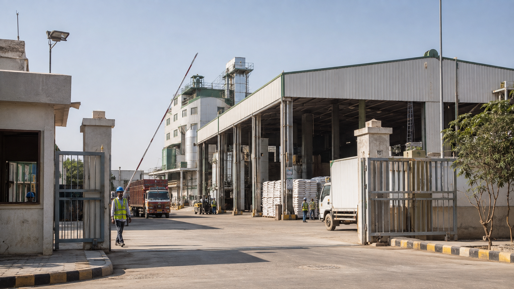
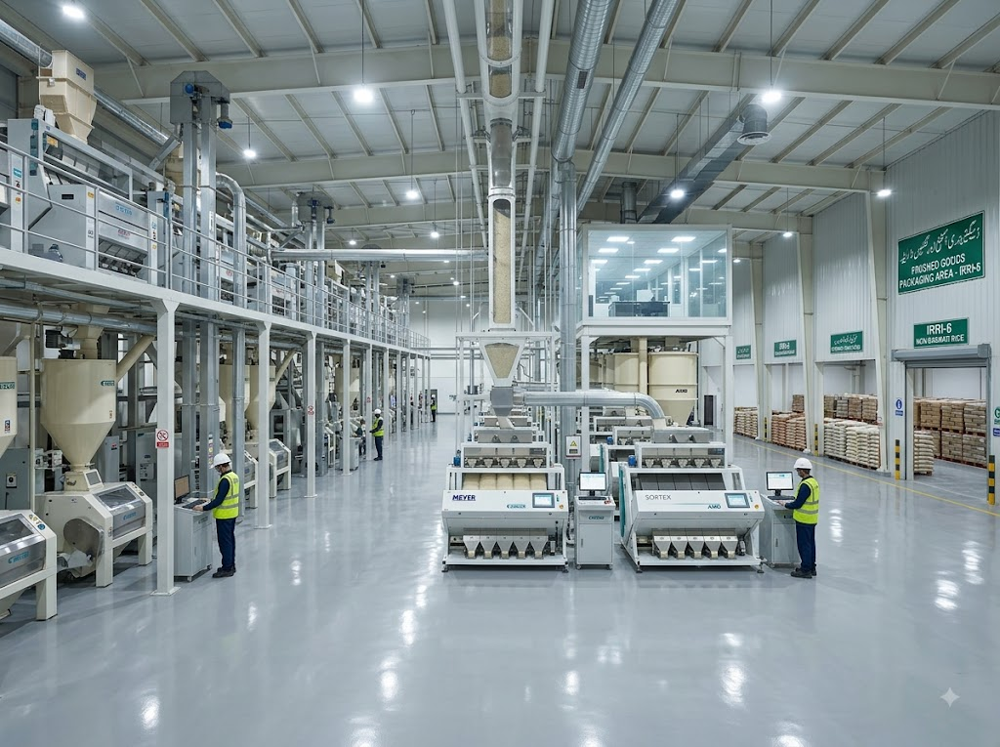
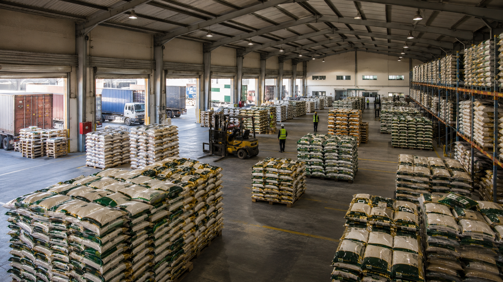

# 🎉 NEW IMAGES UPDATE - COMPLETED

## ✅ Changes Made

### 1. **Contact Page** - Company Entrance Image
**File:** `contact.html`  
**Old Image:** `contact-facility.jpg`  
**New Image:** `contact-facility-02.jpg` ✨

**Changes:**
- Updated facility image to show company entrance/exterior
- Updated Open Graph meta tag for social media sharing
- Alt text updated to "Zaviyar Enterprises facility entrance"

**Location in page:**
- "Our Facility" section at the bottom of the contact page
- Full-width showcase image

---

### 2. **About Page** - Warehouse & Storage
**File:** `about.html`  
**New Image:** `warehouse.jpg` ✨ (Added)

**Changes:**
- Added new "Warehouse & Storage" section in Infrastructure area
- Positioned after "Modern Milling Facility" section
- Includes descriptive text and feature list:
  - Climate-controlled storage environment
  - Systematic inventory management
  - Export-ready packaging zone
- Image positioned on right side (alternating layout pattern)

**Location in page:**
- "State-of-the-Art Infrastructure" section
- Second image grid after milling facility image

---

## 📊 Current Image Usage

### Contact Page (`contact.html`)
```html

```

### About Page (`about.html`)
```html
<!-- Existing: Milling Facility -->


<!-- NEW: Warehouse & Storage -->

```

---

## 📁 Required Image Files

Make sure these image files exist in `assets/images/` folder:

1. ✅ `contact-facility-02.jpg` - Company entrance/exterior (Contact page)
2. ✅ `warehouse.jpg` - Warehouse storage facility (About page)

---

## 🎯 Image Purpose & Context

### **contact-facility-02.jpg**
- **Purpose:** Show company entrance and front exterior
- **Context:** Gives visitors a clear view of the physical location
- **Page:** Contact Us page - "Our Facility" section
- **Style:** Professional exterior/entrance shot

### **warehouse.jpg**
- **Purpose:** Showcase storage and warehousing capabilities
- **Context:** Demonstrates infrastructure and capacity
- **Page:** About Us page - "Infrastructure" section
- **Style:** Interior warehouse with storage areas visible

---

## ✨ Benefits of These Changes

1. **Better Visual Flow on About Page:**
   - Now shows both processing facility AND storage capability
   - Alternating left-right image layout creates professional appearance
   - More comprehensive view of company infrastructure

2. **More Accurate Contact Page:**
   - `contact-facility-02.jpg` shows actual entrance
   - Visitors can visually identify the facility when visiting
   - Professional first impression

3. **Enhanced Credibility:**
   - Warehouse image demonstrates scale and capacity
   - Shows investment in proper storage infrastructure
   - Reinforces quality control capabilities

---

## 🔍 Testing Checklist

- [ ] Visit **Contact page** and verify `contact-facility-02.jpg` displays
- [ ] Verify image shows company entrance clearly
- [ ] Visit **About page** and scroll to Infrastructure section
- [ ] Verify both milling facility AND warehouse images display
- [ ] Check responsive layout on mobile (images stack properly)
- [ ] Test lazy loading (images load as you scroll)
- [ ] Verify alt text appears if images fail to load

---

## 📱 Responsive Behavior

Both pages maintain responsive design:

- **Desktop (md and above):** Images display side-by-side with text
- **Mobile (below md):** Images stack above text
- **Lazy loading:** Images only load when scrolled into view
- **Fallback:** Gray background shows while image loads

---

## 🎨 Design Consistency

Both new image sections follow the website's design system:

- **Rounded corners:** `rounded-lg`
- **Shadow effects:** `shadow-lg` and `shadow-xl`
- **Emerald green headings:** `text-emerald-900`
- **Consistent spacing:** `py-16`, `gap-8`, `mb-12`
- **Professional typography:** Clear hierarchy and readable text

---

## 📝 Summary

**Total Images Updated:** 2 new images integrated  
**Pages Modified:** 2 (contact.html, about.html)  
**New Total Website Images:** 24 images (up from 23)

**Changes are production-ready** and maintain all existing:
- SEO optimization
- Accessibility features
- Responsive design
- Performance optimizations (lazy loading)

---

**Status:** ✅ **COMPLETE AND READY FOR DEPLOYMENT**

All HTML updates have been made. Simply ensure the two image files are in place:
- `assets/images/contact-facility-02.jpg`
- `assets/images/warehouse.jpg`
